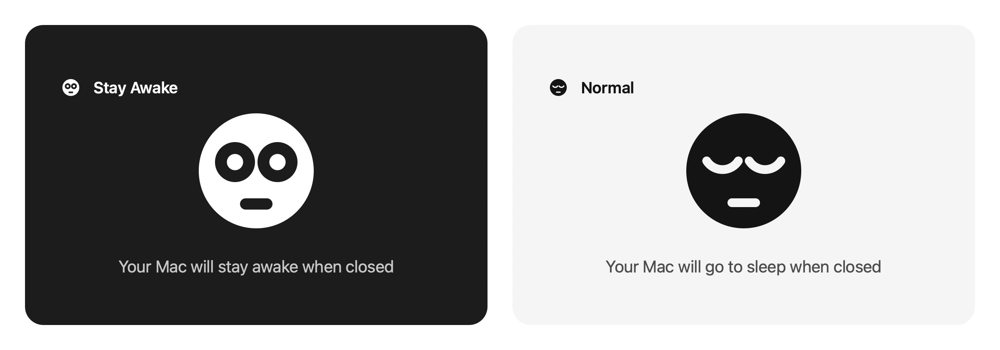

# Sleepless

A macOS menu-bar app. It toggles `sudo pmset -a disablesleep 0/1`.
The Mac then stays awake, also when the lid is closed.



## Install

Download the **`.dmg`** from the
[latest release](https://github.com/jdanino/sleepless/releases/latest), open
it, and drag **Sleepless** into **Applications**.

The app is signed with a Developer ID and notarised by Apple, so a plain
double-click opens it. There is no right-click trick and no `xattr` command.
The ticket is stapled to the app itself, so the first start also works with no
network.

The app has no Dock icon. Look for the face in the menu bar at the top right.

**Drag it to Applications first. Do not start it from the disk image.** macOS
runs an app that is still in a download or on a disk image from a random
read-only shadow copy (App Translocation). The toggle still works there, but
*Open at Login* records a path that is gone at the next start. A drag in the
Finder ends the translocation.

**Or build it yourself:**

```bash
git clone https://github.com/jdanino/sleepless.git && cd sleepless && ./build.sh && open ~/Applications/Sleepless.app
```

That needs the Xcode command-line tools (`xcode-select --install`).

## Use

- **Left click** on the menu-bar icon: toggle the setting.
- **Right click** (or control-click): open the menu.
- Face with **wide eyes**: sleep is off, the Mac stays awake. It stares,
  because it cannot sleep.
- Face with **closed eyes**: sleep is on, the Mac may sleep.

The app reads the true state from `pmset -g` every 5 seconds and after wake.
Thus the icon is correct, also when you change the setting from the terminal.

## Updates

The app looks for a newer version 5 seconds after it starts, and then one time
each day. It asks only `api.github.com` for the newest release of this
repository, and it sends nothing about you.

- Nothing found: the app stays silent.
- Something found: the menu says **"Version 1.3 is available…"**. Click it to
  open the release page.
- The menu item **Check for Updates…** does the same look immediately, and
  says the result in a window.

The app does **not** replace itself. You download the new DMG and drag it over
the old app. That is a deliberate choice: an app that can replace its own
files is also a way to install anything, and the check that stops that misuse
is easy to get wrong.

## Your password

`pmset -a disablesleep` needs root permission, so the app asks for your
password — one time only.

**The first click** shows a window that says why, before macOS asks anything:
only root may change this setting, and that one password installs a rule that
permits exactly two `pmset` commands and nothing else. A checkbox there lets
you refuse the rule and give your password at each toggle instead.

Then the standard macOS dialog appears. It shows the name **Sleepless**,
because the app runs the AppleScript inside itself (`NSAppleScript`) and does
not start the `osascript` process. That one privileged step installs
`/etc/sudoers.d/sleepless` **and** applies the toggle together.

Each toggle after that runs with `sudo -n` and shows no dialog.

The rule permits only these two exact commands, and only for your user:

```
<user> ALL=(root) NOPASSWD: /usr/bin/pmset -a disablesleep 0, /usr/bin/pmset -a disablesleep 1
```

The menu item *Toggle without a password* shows the state of the rule with a
checkmark. Remove the checkmark to delete the rule. The app then asks for the
password at each toggle, and it does not install the rule again. Put the
checkmark back to install the rule again.

If the rule is deleted from outside the app, the next toggle finds this and
asks for the password again.

## Warning

`disablesleep 1` stays active after a restart. The app does not reset it when
you quit. Set the toggle back to sleep before you put the Mac in a bag.

## For developers

Building the app, the files, and how a release is signed and notarised:
[RELEASING.md](RELEASING.md).
